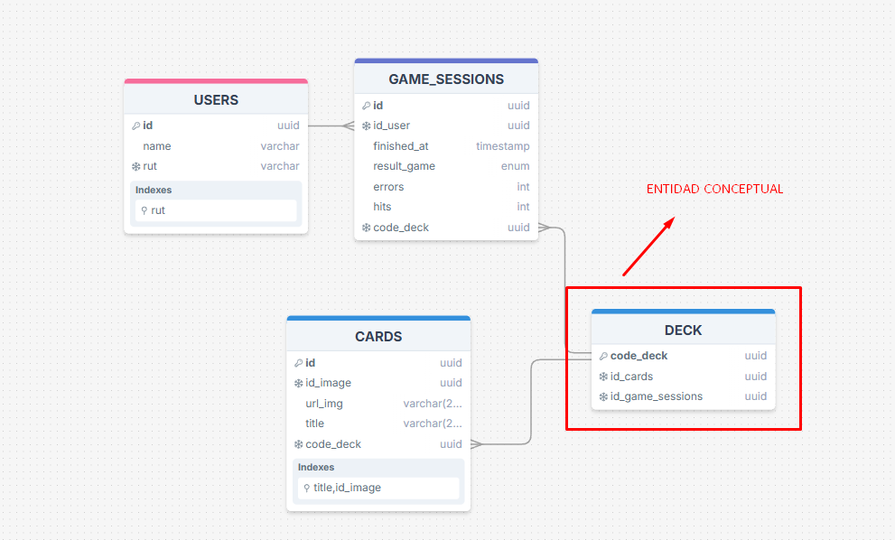

# DESAFIO UNO FULLSTACK

## PASOS PARA EJECUTAR EL PROYECTO

1. Clonar el repositorio desde la sigueinte URL (clonar la rama main):
```
git clone https://github.com/JoaquinAAS97/uno-test-full-stack.git 

```
2. Acceder a la ruta de la carpeta backend ```cd backend/```  leer el READM.md y seguir todos los pasos que se le indica:
__NOTA IMPORTANTE: ```EJECUTAR LA RUTA SEED del backend para que las cartas sean registradas previamente```__

3. Acceder a la ruta de la carpeta backend ```cd frontend/``` leer el READM.md y seguir todos los pasos que se le indica:

4. Una vez que todos los pasos anteriores hayan sido realizados, usted debe acceder a la ruta ```cd infra-docke/```

5. Ingresar al Directorio infra-docker que se encuentra en la raiz del proyecto  ```cd infra-docker/```.
   
7. Ingresar los datos de conexión en el archivo ```.env-template``` y renombrar el archivo a ```.env```

8. Consturir el docker-compose, para esto usted debe ejecutar el siguiente comando dentro de la carpeta ```cd infra-docker/```:

```
docker compose up --build
```

### SOBRE STACK TECNOLOGICO

## Backed:
  - Postgres SQL
  - Framework Nest.js + TypeORM
  - Typescript

## Frontend:
  - Next.js
  - React js.
  - Typescript

## Test:
  - jest + React Testing Library


# SOBRE EL DISEÑO DE LA BASE DE DATOS:
## Se diseñaron 3 entidades:
  - Users
  - Game_session: sesiones de juego, recopilacion de estadisticas de cada partida.
  - CARDS --> entidad que permite guardar las cartas (Se usa para ejecutar el SEDD de las imagenes dispuestas en esta ruta: GET https://challenge-uno.vercel.app/api/images)
  - DECK --> entidad sólo conceptual, es decir, el mazo se genera de forma virtual, no se guarda en base de datos, esto para seguir las practicas de juegos similares, la entida se genera por cada sesion de juego y deja como rastro su código de mazo, el cual es usado para el registro de la entidad Game_session, con la finalidad de saber con qué mazo se jugó y cuando este fue  generado por el juego.

## DISEÑO:




## Sobre funcionalidades:
  ### __El juego realiza:__
   - inicio sesion de usuario
   - registro de usuario
   - aceso a menu e historial de resultaso de juegos pasados
   - el juego genera un mazo aleatorio utilizando la entidad de cards
   - Para que el juego genere el mazo aleatorio, además, usa el algoritmo Fisher-yates
   - entrega el mazo y lo sirve para el juego respetando el ciclo de vida del mismo
   - cuando termina el juego, muestra un mensaje final al usuario (usuario "x" ganó, perdió o se rindió)
   - Finalmente, el juego envia las estadisticas de la partida al servidor.
