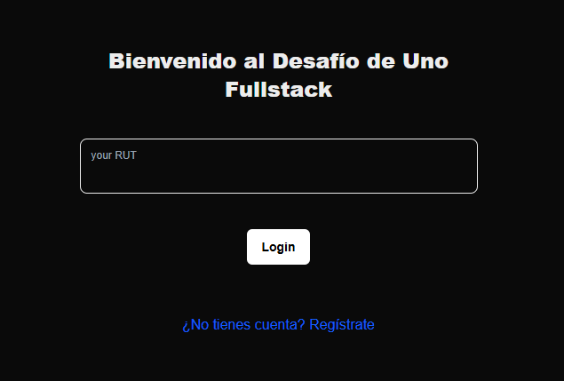
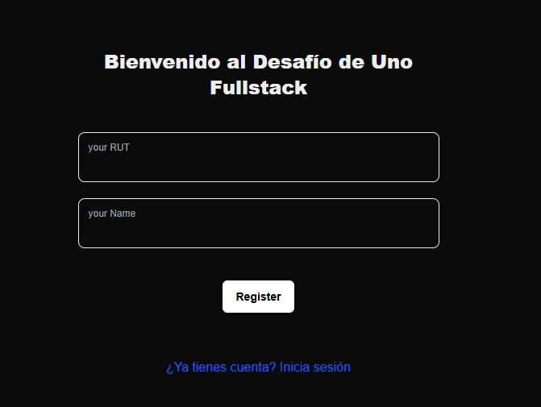
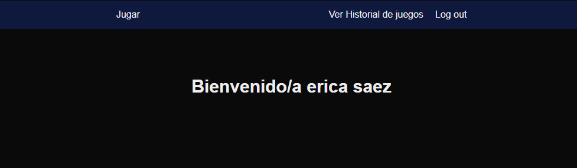
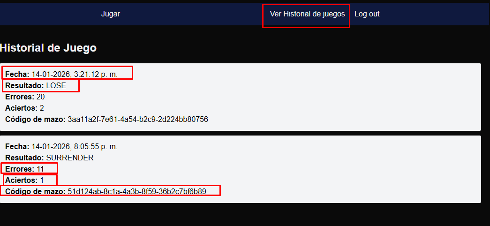
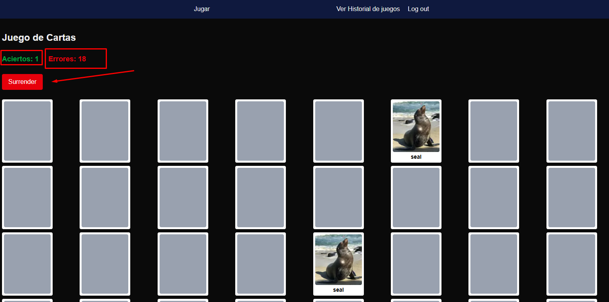
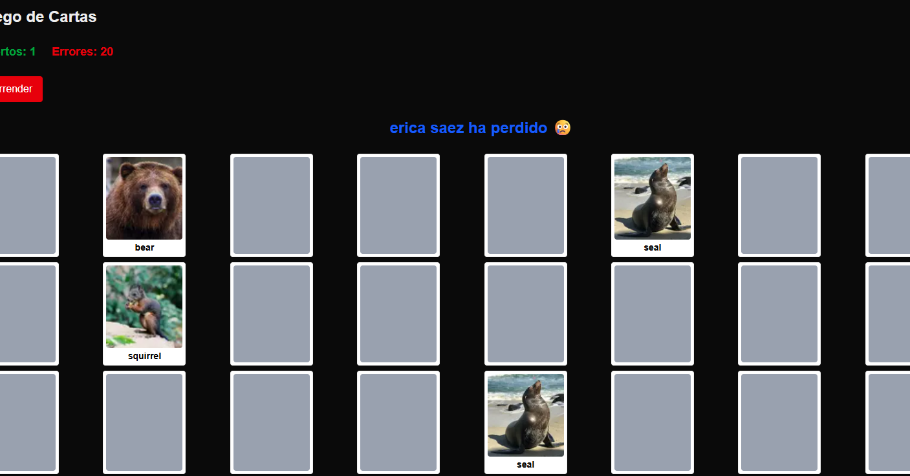

<p align="center">
  <a href="https://nextjs.org" target="blank"></a>
  <a href="https://www.typescriptlang.org" target="blank"></a>
  <a href="https://es.react.dev" target="blank"></a>
</p>

# Proyecto Desafío - Uno - FullStack (Frontend)

## Configuraciones previas

1. Clonar proyecto usando la siguiente URL:
```
git clone https://github.com/JoaquinAAS97/uno-test-full-stack.git
```
2. Acceder a la ruta de la carpeta backend ```cd frontend/``` y Ejecutar la instalacion de los node_modules:

```
npm install
```

3. Levantar el servidor en modo desarrollo:

```
npm run dev
```

4. Sobre el STACK tecnológico:
 - Framework Next.js --> server components
 - React JS --> Librería UI
 - Test con jest
 - Lenguaje TS 


## SOBRE EL DISEÑO DEL FRONTEND:

## 1. Login y register :


### Login:




### Register:




## Menú principal



## Historial de juegos




## Sesion de juego



## Mensajes Finales al usuario

